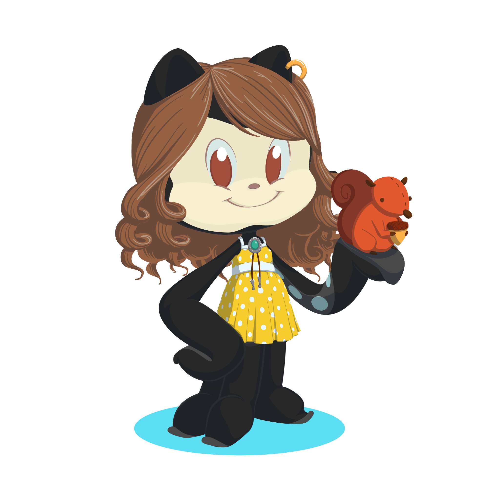

<h1 align="center" color="8100A7">Seja bem-vindo(a)! Você pode me chamar de Bea!</h1> 

  
  
  

<h2>Tecnologias</h2>

  

<h3>Linguagens</h3>
  
  
  
  

<h3>Front-End</h3>
  
    
  
  

<h3>Back-End & Data</h3>
  
  
  

<h3>Mobile</h3>
  

<h3>Tools</h3>
  
  
   
  
  
  
   
  
  
   
  
  
   
  
  
  
  
   
  
<h3>Api's</h3>
  
  
  

<h2>Análises do perfil</h2>

<a href="https://github.com/devbeafg">
<a href="https://github.com/devbeafg">

<a href="https://github.com/devbeafg"> 

<a href="https://github.com/devbeafg"> 
<!-- Proudly created with GPRM ( https://gprm.itsvg.in ) -->

  

  

  <a href="https://github.com/devbeafg">
    
  
      

  [GIF Parrot Pixabay](https://pixabay.com/pt/gifs/papagaio-p%C3%A1ssaro-verde-pixel-19696/)

